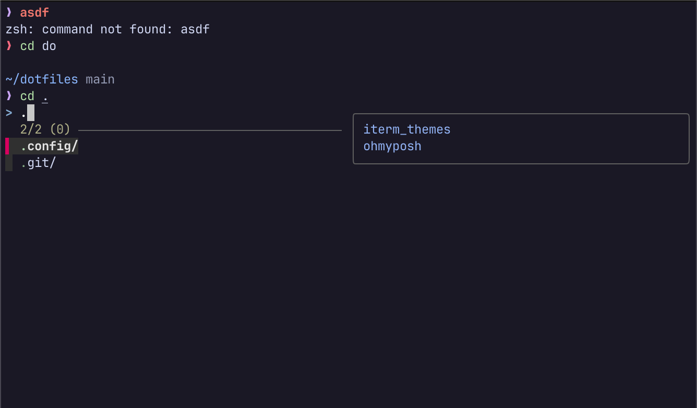

# Dotfiles

Personal dotfiles managed with GNU Stow. These configuration files create a clean, minimalist development environment with a focus on productivity and aesthetics.



## Requirements

- GNU Stow
- Zsh
- Oh My Posh
- Fzf
- Zoxide
- Zinit

## Installation

### 1. Install Dependencies

#### On macOS

```sh
brew install stow
```

### 2. Clone the Repository

### 3. Deploy Configurations

Use Stow to symlink the configurations:

```sh
# Deploy all configurations
stow .

# Deploy a specific configuration
stow zsh
```
